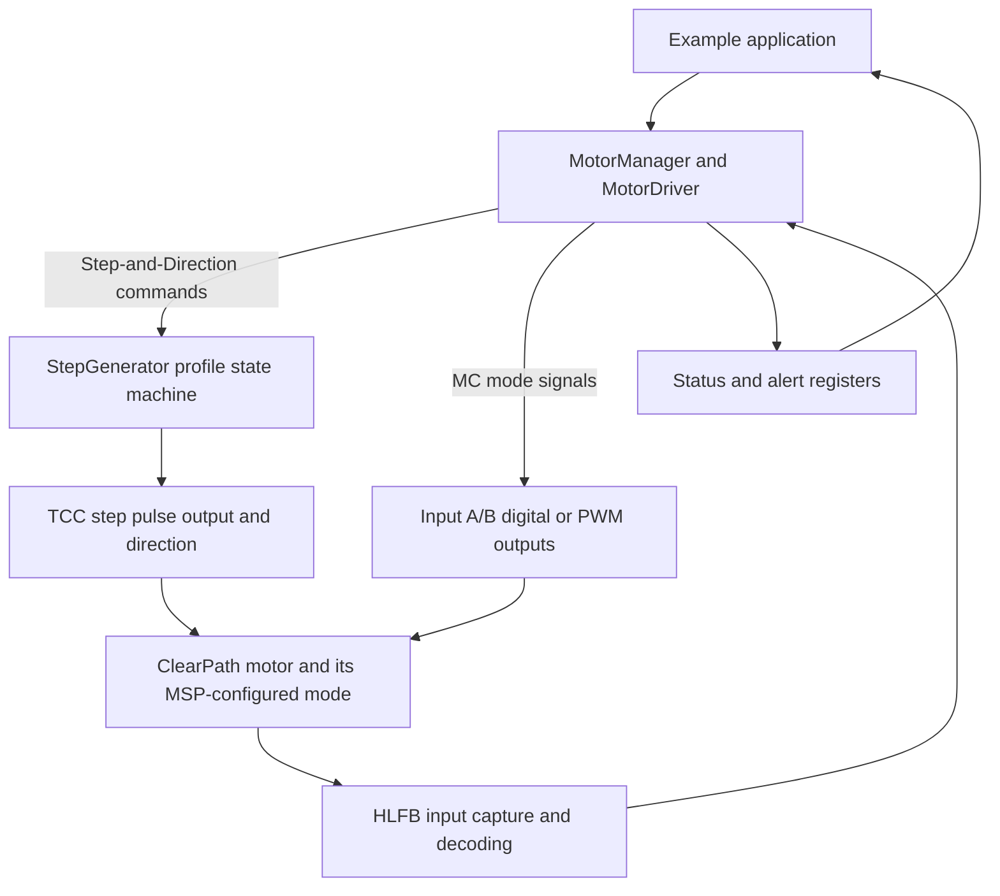

# ClearPath Motion Implementation Map

This document maps the ClearPath example behavior to the ClearCore library code that implements it. It covers both Step-and-Direction motion generated by ClearCore and ClearPath-MC modes driven through Input A/Input B. ClearPath operating mode, input filtering, homing, position selections, torque/speed limits, and HLFB mode are configured in the ClearPath MSP software; the examples depend on those settings matching their wiring and constants.

## Two Control Paths



In Step-and-Direction mode, ClearCore computes and emits the position/velocity profile as pulses. In MC examples, ClearCore generally sends electrical input signals, while the configured ClearPath mode interprets them and performs the move. These paths share the `MotorDriver` connector, enable handling, HLFB processing, and status reporting, but they do not share the same command semantics.

## Runtime Path

1. `Reset_Handler()` calls `InitSysManager()`, which initializes the board and its subsystems. `SysManager::Initialize()` initializes the motor connectors and `MotorManager`, configures interrupts, then marks the system ready. See [SysManager::Initialize](../../../ClearCore-library/libClearCore/src/SysManager.cpp#L230) and the [startup entry points](../../../ClearCore-library/libClearCore/src/SysManager.cpp#L638).
2. The TCC0 sample interrupt calls `SysManager::FastUpdate()`. The fast update runs at 5 kHz (one 200 microsecond sample), refreshes connectors and supporting input/status subsystems, then updates slow/background work at the configured cadence. See [SysTiming.h](../../../ClearCore-library/libClearCore/inc/SysTiming.h#L42) and [SysManager.cpp](../../../ClearCore-library/libClearCore/src/SysManager.cpp#L331).
3. Each motor connector's `Refresh()` samples/decodes HLFB, applies any configured external enable/input/limit wiring, evaluates E-stop/limit/fault conditions, updates status and alert registers, and, in Step-and-Direction mode, advances the profile and queues the next pulse count. See [MotorDriver::Refresh](../../../ClearCore-library/libClearCore/src/MotorDriver.cpp#L168).
4. The slower refresh path advances timed enable-trigger pulses and motor fault-clearing state. It runs from the 1 ms SysTick path unless the build config schedules slow updates with the fast interrupt. See [MotorDriver::RefreshSlow](../../../ClearCore-library/libClearCore/src/MotorDriver.cpp#L945) and [SysManager.cpp](../../../ClearCore-library/libClearCore/src/SysManager.cpp#L363).

### Step-and-Direction Command Path

```mermaid
sequenceDiagram
    participant App as Example
    participant Driver as MotorDriver
    participant Gen as StepGenerator
    participant ISR as 5 kHz refresh
    participant Pins as TCC pulse/direction outputs
    participant Motor as ClearPath

    App->>Driver: Move / MoveVelocity
    Driver->>Driver: Validate enable, alerts, limits, E-stop
    Driver->>Gen: accept command and set profile state
    loop each sample while moving
        ISR->>Gen: StepsCalculated()
        Gen-->>Driver: steps for this sample and direction
        Driver->>Pins: queue pulse count; update direction as needed
        Pins->>Motor: step and direction signal
    end
    Motor-->>Driver: HLFB
    Driver-->>App: status / alert / HLFB state
```

The actual call chain is `MotorDriver::Move()` or `MoveVelocity()` -> `ValidateMove()` -> `StepGenerator` command state -> repeated `StepsCalculated()` calls from `MotorDriver::Refresh()` -> direction output and timer compare-buffer update. `MotorDriver` derives from `StepGenerator`; its overrides add motor readiness and safety checks before accepting the move. See [MotorDriver.h](../../../ClearCore-library/libClearCore/inc/MotorDriver.h#L79), [MotorDriver.cpp](../../../ClearCore-library/libClearCore/src/MotorDriver.cpp#L404), and [StepGenerator.cpp](../../../ClearCore-library/libClearCore/src/StepGenerator.cpp#L404).

## Implementation Responsibilities

| Component | Responsibility | Important behavior |
| --- | --- | --- |
| `SysManager` | Board startup and periodic runtime | Initializes connectors and subsystems; calls connector refresh from the 5 kHz interrupt and slow refresh from the slower tick path. |
| `MotorManager` | Shared motor-pair mode and step clock | M-0/M-1 and M-2/M-3 are configured as pairs. Step clock rate is shared, not per motor. It configures the TCC clock and connector pin mux. |
| `MotorDriver` | Per-motor hardware and state interface | Controls enable through the shift register; drives A/B GPIO or PWM; receives HLFB; validates commands; tracks status, alerts, and configured external enable/input/limit/E-stop connections. |
| `StepGenerator` | Per-motor Step-and-Direction motion generator | Holds the commanded position reference and move state; computes velocity/acceleration profile and pulses per sample. It is not used for the MC input-command modes. |
| `DigitalIn`, `InputManager`, `AdcManager` | External sensor acquisition | Supplies filtered digital state, change callbacks, and analog voltage values used by the examples. |
| TCC, EIC, EVSYS, TC, GPIO, shift register | Signal generation and capture | TCC provides step timing and PWM; EIC/EVSYS/TC capture HLFB pulse timing; GPIO drives direction and direct inputs; shift-register outputs control enable. |
| ClearPath motor / MSP configuration | Motor-side behavior | Applies the selected MC or SD operating mode, homing, profile limits, input filters, position selections, torque limits, and HLFB behavior. These are external prerequisites, not parameters created by the example code. |

The main implementations are [MotorManager.cpp](../../../ClearCore-library/libClearCore/src/MotorManager.cpp), [MotorDriver.cpp](../../../ClearCore-library/libClearCore/src/MotorDriver.cpp), and [StepGenerator.cpp](../../../ClearCore-library/libClearCore/src/StepGenerator.cpp). Public command and status contracts are in [MotorManager.h](../../../ClearCore-library/libClearCore/inc/MotorManager.h), [MotorDriver.h](../../../ClearCore-library/libClearCore/inc/MotorDriver.h), and [StepGenerator.h](../../../ClearCore-library/libClearCore/inc/StepGenerator.h).

## Step-and-Direction Motion Semantics

### Position commands

- `Move(distance)` is relative to the end position of the current move by default. `Move(distance, MOVE_TARGET_ABSOLUTE)` treats `distance` as an absolute pulse-generator target. The absolute command is converted to a delta from `PositionRefCommanded()`.
- A position command received during motion can be merged/replanned against the current move. The header explicitly recommends waiting for `StepsComplete()` if a caller needs the previous move to finish before issuing another.
- Position, velocity, and acceleration are expressed in step pulses, pulses/second, and pulses/second squared. The position reference is the pulse generator's commanded/reference position, not a measured ClearPath encoder position.
- `PositionRefSet()` changes that software reference; it does not move the motor or independently verify a physical home location.

See [`Move()` and the target enum](../../../ClearCore-library/libClearCore/inc/StepGenerator.h#L66), [`PositionRefSet()`](../../../ClearCore-library/libClearCore/inc/StepGenerator.h#L153), and [absolute/relative example helpers](../../../ClearCore-library/Microchip_Examples/ClearPathModeExamples/ClearPath-SD_Series/MovePositionAbsolute/MovePositionAbsolute.cpp#L165).

### Profile generation

`StepGenerator::StepsCalculated()` is a sampled state machine. Its states cover start, acceleration, cruise, position deceleration, velocity deceleration, direction change, end, and idle. Short position moves use a triangular peak velocity when the requested distance cannot reach the configured velocity limit; longer moves use a cruise segment. A direction reversal during a velocity move decelerates to zero before changing direction.

Internally, position/velocity/acceleration are represented in fixed-point Q15 units per sample. `VelMax()` accepts pulses/second, `AccelMax()` accepts pulses/second squared, and both convert to sample-domain values. Limits are clipped to the output capacity. At the normal 500 kHz step clock and 5 kHz sample rate, the clock period provides up to 100 pulse slots per sample. ClearCore recommends normal clocking for ClearPath; the higher clock rates are not automatically safe for every motor configuration. See [clock rate definitions](../../../ClearCore-library/libClearCore/inc/MotorManager.h#L35), [sample timing](../../../ClearCore-library/libClearCore/inc/SysTiming.h#L40), and [profile implementation](../../../ClearCore-library/libClearCore/src/StepGenerator.cpp#L39).

### Velocity and stopping

- `MoveVelocity(signed_velocity)` replaces the active velocity target and ramps toward the new target using the configured acceleration. A zero target is a ramp-to-zero velocity command.
- `MoveStopAbrupt()` clears the current profile immediately. It can stop pulse generation abruptly; it does not mean the mechanical load has stopped safely.
- `MoveStopDecel(decelMax)` changes the target to zero and ramps down. The stopping acceleration is the greater of the active move acceleration and the configured E-stop deceleration. A nonzero argument updates that E-stop deceleration setting.
- `StepsComplete()` means the step generator has no active command. The motor may still be moving. For positional success, examples wait for both `StepsComplete()` and the required HLFB assertion.
- `CruiseVelocityReached()` indicates the generator's profile is in cruise; it does not mean a position move is complete.

See [StepGenerator command methods](../../../ClearCore-library/libClearCore/inc/StepGenerator.h#L98), [stopping implementation](../../../ClearCore-library/libClearCore/src/StepGenerator.cpp#L385), and [velocity/limit implementation](../../../ClearCore-library/libClearCore/src/StepGenerator.cpp#L464).

## ClearPath-MC Input Signaling

The MC examples use four ClearCore connector modes. `MotorManager::MotorModeSet()` applies the mode to a connector pair:

| ClearCore mode | A signal | B signal | Typical use in the examples |
| --- | --- | --- | --- |
| `CPM_MODE_A_DIRECT_B_DIRECT` | Digital | Digital | Preset selection, direction, quadrature sequence, or direct input state. |
| `CPM_MODE_A_DIRECT_B_PWM` | Digital | PWM | Direction/lock plus unipolar position, velocity, or torque magnitude. |
| `CPM_MODE_A_PWM_B_PWM` | PWM | PWM | Bipolar velocity with a second PWM torque-limit command. |
| `CPM_MODE_STEP_AND_DIR` | Direction | Step pulse train | ClearCore-generated position/velocity motion or ClearPath pulse-burst modes. |

In MC modes, values have meaning only under the motor's selected MSP configuration. The host-side examples validate values and scale them into 8-bit PWM duty values or digital states; the ClearPath interprets those signals according to its mode setup. PWM resolution, deadband, direction polarity, input filtering, configured speed/torque limits, and position/increment tables must match the example. See [mode selection and pin mux](../../../ClearCore-library/libClearCore/src/MotorManager.cpp#L140) and [input state/PWM implementation](../../../ClearCore-library/libClearCore/src/MotorDriver.cpp#L524).

### Trigger pulses

`EnableTriggerPulse(count, width, block)` toggles the enable output to create motor-side trigger pulses in modes such as Move Incremental Distance and Pulse Burst Positioning. The slow refresh path times each half of the pulse; there are two toggles per requested pulse. With `block=true`, the call waits until the train ends. The pulse width must match the configured MSP trigger-pulse range, and callers must allow the motor's configured input filters to settle before triggering. This is a command trigger, not a general-purpose enable/disable operation. See [EnableTriggerPulse contract](../../../ClearCore-library/libClearCore/inc/MotorDriver.h#L597) and [pulse generation](../../../ClearCore-library/libClearCore/src/MotorDriver.cpp#L614).

## Feedback, Status, and Safety

### HLFB

The HLFB input can represent a static asserted/deasserted state or a PWM measurement. The example must set `HlfbMode()` and `HlfbCarrier()` to match the motor's MSP configuration. In PWM modes, the library captures pulse period and width using the external interrupt/event/timer path, waits for enough valid captures to avoid reporting a clipped edge, then exposes `HLFB_HAS_MEASUREMENT` and `HlfbPercent()`. Bipolar PWM is converted to a signed percentage; a lost carrier falls back to static-state handling. The meaning of asserted and measured values depends on the configured HLFB mode: examples use asserted for move-done or at-target-velocity and use PWM percentage for torque or speed feedback. See [HLFB enums and API](../../../ClearCore-library/libClearCore/inc/MotorDriver.h#L139) and [capture/decoding](../../../ClearCore-library/libClearCore/src/MotorDriver.cpp#L168).

### Status and alerts

`StatusReg()` is a current snapshot; `StatusRegRisen()` and `StatusRegFallen()` are clear-on-read edge snapshots. The register includes ready state, enabled, active steps, target-position/target-velocity indications, direction, HLFB state, limit inputs, E-stop input, and alert presence. In Step-and-Direction mode, `AtTargetPosition` requires an enabled positional move, no active step command, and asserted HLFB. `AtTargetVelocity` is based on the profile reaching cruise (or an idle velocity command) plus HLFB not being deasserted. Treat these as mode-specific status signals, not as interchangeable with `StepsComplete()`.

`ValidateMove()` rejects a command when alerts are latched, enable is not requested, E-stop is active, or the requested direction is already at its corresponding limit. While moving, an E-stop requests decelerated stop; directional hardware limits also initiate deceleration. The alert register records why a command was rejected or motion was canceled and blocks later moves until explicitly cleared. A non-static HLFB configuration that becomes deasserted while enabled is treated by the driver as a motor fault and stops the profile. See [register definitions](../../../ClearCore-library/libClearCore/inc/MotorDriver.h#L250), [status/alert calculation](../../../ClearCore-library/libClearCore/src/MotorDriver.cpp#L342), and [move validation](../../../ClearCore-library/libClearCore/src/MotorDriver.cpp#L470).

Examples usually leave automatic fault handling disabled. Some include optional recovery that cycles enable and/or clears alerts; their comments warn that doing so can immediately restore motion and must only be enabled after the safety consequences are understood. A new implementation should preserve the distinction between detecting a fault, stopping, clearing a latch, and authorizing motion again.

## Required Pieces for a Working Implementation

1. **Board and connector startup:** initialize clocks, connectors, timers, event routing, GPIO, ADC, input manager, shift register, and motor manager before application commands are used.
2. **Pair-wide motor configuration:** define the allowed connector modes and shared step-clock choices; switch pin muxing safely when changing modes and terminate incompatible active step commands.
3. **Per-motor command state:** store target/reference position, direction, velocity, acceleration/deceleration, and current profile state. Protect shared command state against the sample interrupt while accepting commands.
4. **Step profile and signal output:** update a bounded profile at the fixed sample period; calculate integer pulses per sample; emit direction and pulse timing through hardware timers; clip to configured output rate and numeric bounds.
5. **MC input outputs:** expose direct A/B state, A/B PWM, and trigger-pulse operations only in compatible modes. Preserve the motor-side units/configuration contract and the trigger timing requirements.
6. **Enable and feedback:** sequence enable through the hardware output, track enabling/ready state, configure HLFB input capture, decode static/PWM/bipolar modes, and detect carrier loss.
7. **Safety/state reporting:** validate requests, observe E-stop and directional limits, stop/cancel motion appropriately, latch diagnostic alerts, report current and edge status, and require explicit recovery policy.
8. **Example-level conversions and homing:** convert analog/digital commands to selected units, honor input filters, and implement either motor-configured homing or an explicit seek/stop/backoff/reference sequence.
9. **Hardware verification:** check direction polarity, pulse clock/rate, HLFB mode/carrier, enable behavior, limits, E-stop, actual completion, and recovery on real configured hardware. The examples' serial output is diagnostic only and is not required for motion.

## Source Entry Points

- [StepGenerator API](../../../ClearCore-library/libClearCore/inc/StepGenerator.h) and [profile state machine](../../../ClearCore-library/libClearCore/src/StepGenerator.cpp)
- [MotorDriver API](../../../ClearCore-library/libClearCore/inc/MotorDriver.h) and [connector implementation](../../../ClearCore-library/libClearCore/src/MotorDriver.cpp)
- [MotorManager API](../../../ClearCore-library/libClearCore/inc/MotorManager.h) and [clock/mode implementation](../../../ClearCore-library/libClearCore/src/MotorManager.cpp)
- [System startup and periodic update](../../../ClearCore-library/libClearCore/src/SysManager.cpp)
- [Sample rate and timing definitions](../../../ClearCore-library/libClearCore/inc/SysTiming.h)
