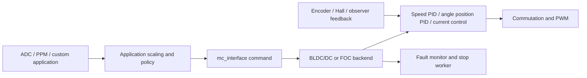

# Precise Motion Interface Gap Analysis

This document assesses the current BLDC firmware against the implementation responsibilities listed in [ClearPath Motion Implementation Map](clearpath_motion_implementation_map.md). It is an inventory of BLDC code, not a design/API specification. The assessment separates reusable motor-stack behavior from features implemented only by a particular input application.

## Executive Summary

The firmware already contains mature motor commutation/current control, speed PID, angular position PID, encoder drivers, per-motor configuration/state on supported hardware, asynchronous electrical-fault shutdown, and several input applications. These are useful lower-level building blocks.

The main missing layer is a reusable motion-command lifecycle. In the reviewed code, position is a normalized angular setpoint rather than a multi-turn axis coordinate; the position PID acts directly on that angle and produces a torque/current request. There is no common point-to-point trajectory planner, move object, completion/settle contract, general homing state machine, or motion-specific limit/E-stop model. Existing examples and applications own their own scaling, filtering, timeout, homing, and status policy.

| Required responsibility | Assessment | Main finding |
| --- | --- | --- |
| 1. Startup and lifecycle | Mostly available | Motor stack initialization, ISR integration, and RTOS workers exist. No `pm_interface` initialization or per-axis lifecycle exists. |
| 2. Motor/axis configuration | Partial | Separate motor configurations and thread-local motor selection exist on supported hardware. There is no axis abstraction, capability validation, or motion grouping. |
| 3. Per-motor command state | Partial | Low-level control mode and setpoints exist. There is no owned motion request, profile state, result, or robust command-acceptance contract. |
| 4. Trajectory generation | Major gap | Speed input ramping exists; point-to-point position trajectories with velocity/acceleration constraints do not. Position targets wrap as angles. |
| 5. Input adapters | Application-specific | ADC/PPM and custom GPIO applications translate inputs to motor commands. No shared motion command/input adapter is present. |
| 6. Enable and motion feedback | Partial | Motor state, fault, encoder position, RPM, and control setpoints are available. No uniform ready/moving/done/settled/position-valid status exists. |
| 7. Safety and motion state | Partial | Electrical/thermal/controller faults are handled. Generic position limits, home-switch handling, and E-stop motion policy are absent from the motor interface. |
| 8. Homing/reference | Application-specific | A specialized Finn AZ homing sequence exists; no reusable home/reference procedure or coordinate-offset lifecycle exists. |
| 9. Verification | Major gap | The checked-in tests cover math, packet recovery, serialization, angles, and an electrical fault test; no motion planner, position lifecycle, homing, limit, or HIL motion suite was found. |

## Existing Control Path

The current path is approximately:

`main()` starts the firmware services and calls `mc_interface_init()`. That initializes motor configuration/state and selects the configured BLDC/DC or FOC implementation. On dual-motor hardware, there are separate motor configurations/states and the control ISR identifies which motor is being serviced. `mc_interface_select_motor_thread()` selects which motor the interface functions address from a calling thread. This is an existing motor-selection mechanism, not a general axis object or motion scheduler. See [firmware startup](../main.c#L342), [`mc_interface_init()`](../motor/mc_interface.c#L169), and [motor selection](../motor/mc_interface.c#L294).

Application inputs call `mc_interface` setters. The motor backend then runs its speed, position, current, and PWM logic in existing control loops. The FOC position loop computes an angular error and turns its PID output into an `iq` current target; it does not calculate a position/velocity trajectory. See [FOC position PID](../motor/foc_math.c#L385) and its [FOC ISR call site](../motor/mcpwm_foc.c#L4514).

## Findings by Responsibility

### 1. Startup and lifecycle: mostly available

**Present:** The firmware initializes configuration, motor interface state, selected motor backend, encoders, and background threads. The existing ADC/PWM control loops and FOC ISR already provide real-time execution contexts for motor control. The low-level motor subsystem should remain the owner of commutation and current regulation.

**Missing for precise motion:** No motion-layer initialization, per-axis reset policy, command ownership, or transition from boot/configuration to "motion ready" is present. The public state is primarily motor-control state (`OFF`, `DETECTING`, `RUNNING`, `FULL_BRAKE`), not an axis lifecycle such as unreferenced, homing, referenced, moving, settling, completed, or motion-faulted. Initialization call sites also do not establish a homing/reference position.

**Implication:** A new motion module needs an explicit initialization and motor-selection lifecycle, while relying on the existing control scheduler/backend. It should define how it is activated/deactivated, what happens to pending moves on configuration changes or motor release, and when an axis is considered usable.

References: [`main()` startup](../main.c#L342), [`mc_interface_init()`](../motor/mc_interface.c#L169), [motor state enum](../datatypes.h#L35), and [control mode enum](../datatypes.h#L182).

### 2. Motor and axis configuration: partial

**Present:** Supported dual-motor builds have two `motor_if_state_t` instances and separate motor configurations. The selected motor is thread-local; the interface resolves commands and telemetry through `motor_now()`. This avoids a process-wide motor selector in every thread, but callers still must select the intended motor in a dual-motor thread.

**Missing:** There is no stable axis handle passed to commands, no motion capability descriptor, no per-axis unit/scale/soft-limit/home configuration, and no group/coordinate-system model. The API does not centralize validation such as whether the selected motor has a usable position sensor for position moves. Motor selection is relevant only on builds with the corresponding dual-motor macros; single-motor builds effectively address motor 1.

**Implication:** The motion layer needs to bind each logical axis to a motor instance/configuration and make motor selection explicit. It should define what "position units" mean per axis and validate sensor/control capabilities before accepting a move. If coordinated axes are in scope, the group model and synchronization guarantees need to be specified independently of the existing dual-motor support.

References: [per-motor state structure](../motor/mc_interface.c#L59), [thread-local selection](../motor/mc_interface.c#L294), [dual-motor FOC setup](../motor/mc_interface.c#L254), and [`mc_interface_init()`](../motor/mc_interface.c#L169).

### 3. Per-motor command state: partial

**Present:** The motor state tracks the active low-level control mode and setpoints such as position, speed, current, duty, and measured state. The FOC state contains `m_pos_pid_set`, `m_speed_pid_set_rpm`, `m_speed_command_rpm`, and `m_pos_pid_now`. `mc_interface_get_state()`, `mc_interface_get_fault()`, and FOC control-mode queries expose parts of that state.

**Missing:** These are controller setpoints, not motion requests. There is no move identifier, queued/current request, requested endpoint, active profile phase, acceptance/rejection result, cancellation reason, or durable completion result. Setters return `void`. Several setters can silently return when `mc_interface_try_input()` reports that input is currently disallowed or initialization is incomplete. `mc_interface_get_control_mode()` reports a real backend mode only for FOC; for BLDC/DC it returns `CONTROL_MODE_NONE`, so it is not a uniform query. Low-level setters directly select/replace the motor control mode rather than preserving a higher-level motion state.

**Implication:** Add a per-axis motion state separate from the backend control mode. Command submission should return a result and define replacement/queue behavior. Status must distinguish requested target from backend setpoint and measured position, and expose why a command was rejected or terminated.

References: [motor-interface state structure](../motor/mc_interface.c#L59), [FOC state fields](../motor/foc_math.h#L156), [position setter](../motor/mc_interface.c#L636), [state getter](../motor/mc_interface.c#L526), [control-mode getter](../motor/mc_interface.c#L545), and [`mc_interface_try_input()`](../motor/mc_interface.c#L1819).

### 4. Trajectory generation and signal output: major gap

**Present:** The backends include speed PID and angular position PID. FOC can ramp a speed setpoint using `s_pid_ramp_erpms_s`; the default is 25,000 ERPM/s. The classic BLDC speed controller runs in its own worker. Duty/current control also includes actuator ramping and limits.

**Missing:** No general point-to-point trajectory generator was found in the motor or application code. There is no reusable absolute/relative move from current position to a target with requested maximum velocity and acceleration/deceleration, no triangular/trapezoidal profile, no jerk limit, no time parameterization, and no profile-aware retarget/cancel behavior. Speed-input ramping is not equivalent: it ramps a speed command, but does not compute a position trajectory or know when to decelerate to hit an endpoint.

The current position API is angular. `mc_interface_set_pid_pos()` applies direction/offset/inversion and calls `utils_norm_angle()` before forwarding the setpoint. Both position PID paths compute angular difference, selecting the short angular error rather than an unwrapped distance. Although the encoder layer has a TS5700N8501 multi-turn read, the FOC position update normalizes `angle_now` before storing it as `m_pos_pid_now`; the position PID state therefore is not a general unbounded axis coordinate. Do not treat this existing feature as a multi-turn position trajectory API.

The command path also has no single documented unit contract: the public setter is named `pos`, backend position comments describe degrees, and the FOC speed backend describes its target as electrical RPM. A motion layer must define axis units and conversion rather than inheriting these ambiguities.

**Implication:** This is the central new implementation. It needs an unwrapped position representation, measured position/velocity input, a real-time profile/setpoint generator, bounds and numeric-overflow policy, and explicit policy for target updates while moving. The planner must feed existing lower-level position/speed/current control in a way that does not compete with the backend ISR.

References: [speed-ramp configuration](../motor/mcconf_default.h#L159), [FOC speed setpoint ramp](../motor/foc_math.c#L506), [position normalization and dispatch](../motor/mc_interface.c#L636), [classic angular PID](../motor/mcpwm.c#L1246), [FOC angular PID](../motor/foc_math.c#L385), [FOC position sample normalization](../motor/mcpwm_foc.c#L3882), and [multi-turn encoder read](../encoder/encoder.c#L534).

### 5. Input adapters: application-specific

**Present:** ADC and PPM applications decode analog/servo input, apply deadband/curves/safe-start behavior, and issue current, duty, speed, or angular position commands. Some applications implement their own input ramping. The Finn AZ application samples board-specific GPIO buttons and a limit input.

**Missing:** The reusable motor interface does not provide a common command-adapter layer for digital selectors, analog position/velocity/torque commands, trigger events, or application-defined unit conversion. Those behaviors are embedded in each application and generally call low-level setters directly. They do not create a motion request with a common range check, completion result, or error policy.

**Implication:** Keep input acquisition and motion semantics separable. Adapters should translate input data into a validated motion request; they should not reproduce axis limits, move state, or homing logic independently. Define whether the future interface needs physical input adapters or only software command entry points.

References: [ADC application](../applications/app_adc.c), [PPM position mode](../applications/app_ppm.c#L354), [Finn AZ application](../applications/finn/app_finn_az.c#L412), and [communications position setter](../comm/commands.c#L511).

### 6. Enable and motion feedback: partial

**Present:** The motor interface exposes controller state, current fault, RPM, tachometer, current, duty, and position set/actual getters. `mc_interface_release_motor()` releases the motor; `mc_interface_brake_now()` requests duty zero. Encoders include multiple sensor types, and position feedback can be read in degrees.

**Missing:** There is no independent axis enable/disable request with a uniform enabling/ready state. Calling a position or speed setter can start the backend in `RUNNING`; that is motor-control activation, not a validated axis-ready transition. There is no standard `at_target` test, position tolerance, zero-speed threshold, settle duration, feedback-valid flag, or "move complete" event. `mc_interface_wait_for_motor_release()` waits for a backend release state, not completion of a target move. The release/brake operations do not encode a requested deceleration profile.

**Implication:** Define motion status using measured feedback, not only a setpoint or backend state. The status contract needs position/velocity validity and timestamps, target tolerance, settle behavior, and distinct meanings for controlled stop, immediate release, and fault shutdown.

References: [state and fault getters](../motor/mc_interface.c#L481), [position set/actual getters](../motor/mc_interface.c#L1451), [release and brake methods](../motor/mc_interface.c#L915), and [position telemetry field](../motor/foc_math.h#L175).

### 7. Safety and motion state: partial

**Present:** `mc_interface_mc_timer_isr()` and other monitors detect electrical/controller faults such as voltage, current, driver, temperature, encoder, and speed faults. Fault handling is delegated to a worker that stops the selected BLDC/DC PWM or FOC PWM, records the fault, and blocks new user commands for the configured stop interval. The interface also has command lock/unlock and limited one-command override support.

**Missing:** The checked motor-layer code has no general positive/negative travel limit, soft-limit window, home-switch abstraction, or motion-layer E-stop policy. A repository search found a limit switch in the Finn AZ application, but this is application-specific. Existing electrical fault shutdown stops PWM; it is not a controlled trajectory deceleration and should not be advertised as a motion stop. The command lock is not a per-axis safety state machine and does not provide an acknowledgement/clear/re-enable protocol for motion faults.

**Implication:** Add motion-specific protective state and request validation without weakening existing electrical fault handling. Specify which protections trigger controlled deceleration, which require immediate backend shutdown, how faults latch, and who may clear/re-enable them. Soft limits require a referenced position and must reject motion farther into an active limit while allowing a defined escape direction.

References: [fault detection entry point](../motor/mc_interface.c#L1879), [fault-stop worker](../motor/mc_interface.c#L2957), [motor command lock](../motor/mc_interface.c#L463), and [application-specific limit sampling](../applications/finn/app_finn_az.c#L412).

### 8. Unit conversion, homing, and reference setting: application-specific

**Present:** ADC/PPM inputs are scaled in their applications. Finn AZ implements a specialized homing/calibration procedure: it filters a board-specific limit input, advances an angle target after a back-off interval, accepts the switch or reports an angular travel bound error, records the home angle, and continues to send position setpoints while its external command remains fresh. It also maintains an application offset.

**Missing:** No reusable homing API or procedure state exists in the motor interface. There is no generic home sensor binding/polarity/debounce config, seek direction/speed/current, timeout/travel bound, backoff, home offset, reference validity, or operation to reset an unwrapped axis coordinate. No shared conversions connect encoder angle, pole pairs, gear ratio, output-side units, and configured travel limits. The Finn implementation is tied to its application pins, angle convention, command protocol, and operating assumptions; it is evidence of one application solution, not a library-level feature.

**Implication:** Homing should be a reusable, observable state machine with explicit parameters and abort/fault behavior. Store the reference separately from raw sensor angle, preserve unwrapped travel, define persistence rules, and invalidate the reference when sensor/configuration state makes it unreliable.

References: [Finn AZ homing parameters](../applications/finn/app_finn_az.c#L67), [homing and reference update](../applications/finn/app_finn_az.c#L428), [position-setpoint dispatch](../applications/finn/app_finn_az.c#L485), and [encoder position functions](../encoder/encoder.c#L534).

### 9. Verification: major gap

**Present:** The `tests/` tree contains angle/math unit tests, packet recovery, float serialization, and an overvoltage-fault test artifact. These can support utility-level and existing electrical-fault regression testing.

**Missing:** No dedicated motor motion tests were found for trajectory generation, absolute/relative target tracking, profile limits, retargeting, stop behavior, move completion/settling, multi-turn rollover, homing, switch filtering, soft limits, E-stop, dual-axis coordination, or fault recovery during a move. No motion hardware-in-the-loop test harness or captured motion acceptance suite was found in the inspected tree.

**Implication:** Verification must be planned alongside the API. Start with deterministic profile/state-machine unit tests, then backend-integration tests with controlled sensor traces, and finally hardware tests that verify real position, speed, stopping distance, sensor-loss handling, limits, and recovery. Electrical fault tests do not prove motion safety or positioning accuracy.

References: [`tests/` inventory](../tests/utils_math/unittest.cpp), [angle tests](../tests/angles/main.c), and [overvoltage test artifacts](../tests/overvoltage_fault/overvoltage_test_v2.pdf).

## Cross-Cutting API Constraints

- **Thread/motor selection:** Commands and getters operate on the motor selected for the calling thread on dual-motor builds. An API that omits axis identity risks applying a valid command to the wrong motor.
- **Silent rejection:** Existing control setters return `void`; a `mc_interface_try_input()` rejection does not report acceptance to the caller. A motion API needs explicit submission status.
- **Angle wrapping:** Current position targets and PID errors are circular. Point-to-point axis motion needs unwrapped position and controlled sensor-wrap handling.
- **No move-completion contract:** Backend `RUNNING` or `OFF` does not mean a requested target was reached. Completion needs a defined feedback/tolerance/settling policy.
- **Stop semantics:** PWM stop, duty zero, current zero, release, and a planned deceleration have different mechanical effects. The interface must name and document them separately.
- **Control ownership:** Position/speed/current commands select backend control modes. A motion planner must be the exclusive owner of those setpoints while a move is active, or define how external commands cancel/replace a move.
- **Sensor configuration:** Position control depends on a valid position source and configuration. Motion requests must not assume that every motor type/sensor configuration provides a meaningful or continuous axis coordinate.

## Recommended Work Order

1. Define per-axis identity, position units, sensor validity, reference validity, target limits, and command/result/status types before adding move algorithms.
2. Implement and test an independent trajectory/state layer for absolute/relative moves, velocity moves, retargeting, stop, abort, and completion criteria. Keep current/commutation loops in their existing owner.
3. Add explicit encoder-to-axis conversion and unwrapped position tracking, including wrap, reset, sensor loss, direction inversion, and multi-turn behavior.
4. Add reusable enable/readiness, homing/reference, limit/E-stop, and fault/recovery policies. Keep application-specific pin wiring and ADC/PPM conversion in adapters.
5. Add unit, backend-integration, and hardware motion tests before exposing the API through additional command transports.

This order identifies dependencies and is not a proposed public API. Detailed scheduling, synchronization, and hardware safety requirements still need to be decided for the target VESC hardware and use case.
